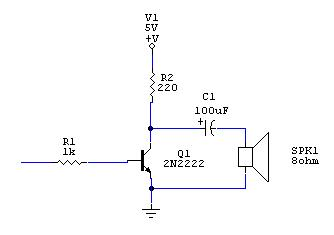

Detailed blog post about this, at: https://www.thanassis.space/monkeyisland.html

- I modified DOSBox to extract the frequency/delay value pairs of the Monkey Island PC-Speaker songs.
- I then managed to squeeze all the music data inside an ATtiny85 (512 bytes of RAM, 8 KB of flash)
- Once I did, I created a small circuit with a speaker, to play the music...
- ...as a gift for my nieces and nephews; whom I will see next week, after being away for so long! (COVID19) 

Yes, their uncle is a complete nerd. And he made sure they grew up meeting Guybrush Threepwood :-) 

Just read the [blog post](https://www.thanassis.space/monkeyisland.html).

--

For those that want to reproduce the circuit: I confess didn't make a schematic, since the HW part is so simple :-)
The only part that matters is the transistor-speaker connection - copying it below from my blog post:

As for the connections, as you can see [at the top of the code](beeperJukeboxTiny.ino)...

- The transistor's base gets connected to PB0 *(via the 1K resistor)*
- The LED is connected to PB1 *(via a 220 Ohm resistor)*
- ...and the pushbutton to PB3.

The pushbutton pin is pulled to GND via a 10K resistor, but pulled up to VCC when the button is pushed.

And here's some ASCII-art of the ATtiny85, to show where these pins are:

                                        +--------+
           (PCINT5/~RESET/ADC0/dW) PB5  | 1    8 | VCC
    (PCINT3/XTAL1/CLKI/~OC1B/ADC3) PB3  | 2    7 | PB2 (SCK/USCK/SCL/ADC1/T0/INT0/PCINT2)
     (PCINT4/XTAL2/CLKO/OC1B/ADC2) PB4  | 3    6 | PB1 (MISO/DO/AIN1/OC0B/OC1A/PCINT1)
                                   GND  | 4    5 | PB0 (MOSI/DI/SDA/AIN0/OC0A/~OC1A/AREF/PCINT0)
                                        +--------+

Enjoy!

And share pictures if you make one :-)
